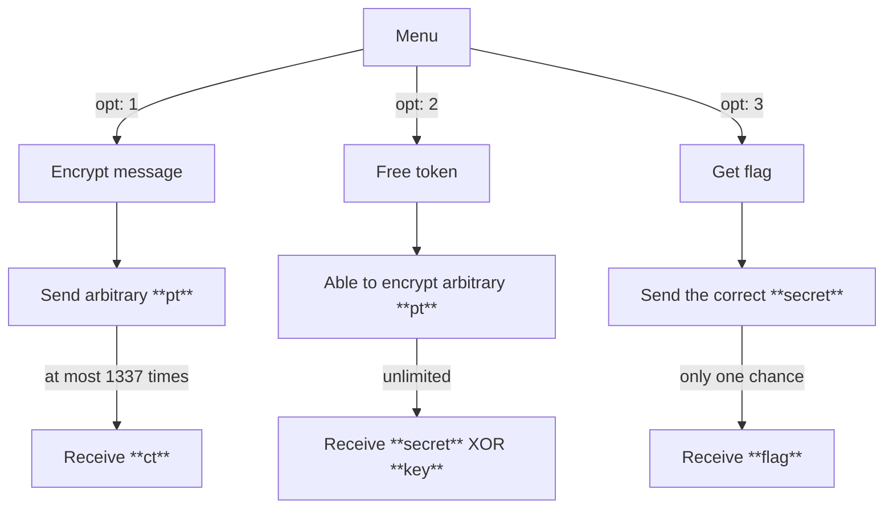

# ezCipher

- Category: Crypto
- Score: 500/500
- Solves: 0
- Flag: `W1{1nt3rp0l4t10n_4tt4ck_1s_fun_r1ght?_70148efc9a74a9326d58c0475b52}`

## Solution

### Overview

Bellow is the general flow of this challenge:



From this point, we need to overcome two things:
- **Get Free Token:** Somehow we perform Chosen Plaintext Attack $\rightarrow$ then be able to encrypt arbitrary plaintext (by recover `master_key` of Cipher or mabe just the encryption process?) $\rightarrow$ then receive `secret` $\oplus$ `random_key`.
- **Get Flag:** Somehow we can recover `secret` from `secret` $\oplus$ `random_key`$_{i}$.

### Stage 1: Recover Encryption Algorithm

The encryption algorithm used in this challenge called **PURE** - which is a variant of [KN-Cipher](https://en.wikipedia.org/wiki/KN-Cipher). For **KN-Cipher**, it's provably safe from the differential cystanalysis, however, for **PURE-Cipher**, it turned out that the way of constructing `SBOX` are vulnerable to a new attack called [Interpolation Attack](https://en.wikipedia.org/wiki/Interpolation_attack).

> [!TIP]
> Before going further, I rcm you guys reading this [paper](https://www.esat.kuleuven.be/cosic/publications/article-311.pdf).

Bellow are some key points of **PURE-Cipher:**
- `init_sbox:` it's basically $S(x) = x^3 + 3$ for $x \in \mathbb{F}_{2^{16}}$.
    ```c
    uint16_t* sbox = NULL;

    void init_sbox() {
        sbox = mmap(0, 1<<24,
            PROT_READ|PROT_WRITE, MAP_PRIVATE|MAP_ANONYMOUS, -1, 0);
        
        if (sbox == MAP_FAILED) {
            perror("mmap failed :<");
            exit(1);
        }
        
        for (size_t i=0; i<0x10000; ++i)
            sbox[i] = gf_pow(i, 3) ^ 3;
    }
    ```
- `key_expansion:` convert 32-bytes `master_key` to array of `rkeys` (size = 16)
    ```c
    static void key_expansion(uint16_t* rkeys, uint8_t* master_key) {
        for (int i=0; i<KEY_SIZE/2; ++i)
            rkeys[i] = (master_key[2*i+1] << 8) | master_key[2*i];
    }
    ```
- `Cipher_encrypt:` Let $\left(s_{0}^{(i)}, s_{1}^{(i)}, s_{2}^{(i)}, s_{3}^{(i)}\right)$ be the state of plaintext at round `i` (for $i \in \overline{0,3}$) then the encryption is simply
    $$
    \begin{cases}
        s_{0}^{(i+1)} &= \left(s_{1}^{(i)}   + k_{0}^{(i)}\right)^3 + 3 \\
        s_{1}^{(i+1)} &= \left(s_{2}^{(i)}   + k_{1}^{(i)}\right)^3 + 3 \\
        s_{2}^{(i+1)} &= \left(s_{3}^{(i)}   + k_{2}^{(i)}\right)^3 + 3 \\
        s_{3}^{(i+1)} &= \left(s_{0}^{(i+1)} + k_{3}^{(i)}\right)^3 + 3
    \end{cases} \qquad,\forall i \in \overline{0, 3}, \qquad\text{and }
    \begin{cases}
        pt &= \left(s_{0}^{(0)}, s_{1}^{(0)}, s_{2}^{(0)}, s_{3}^{(0)}\right)\\ 
        ct &= \left(s_{0}^{(4)}, s_{1}^{(4)}, s_{2}^{(4)}, s_{3}^{(4)}\right) 
    \end{cases}
    $$
    ```c
    void Cipher(state_t* state, const uint16_t* rkeys) {
        for (int r=0; r<NUM_ROUNDS; ++r) {
            for (int i=0; i<4; ++i)
                (*state)[i] ^= sbox[(*state)[(i + 1)%4] ^ rkeys[i + r*4]];
        }
    }
    ```

We're working on Finite Field $\mathbb{F}_{2^{16}}$, so let's treat everything is just algebra operations, then the encryption is sth look like:

$$
\begin{cases}
    s_{0}^{(4)} &= F_{0}^{\overline{k}}\left(s_{0}^{(0)}, s_{1}^{(0)}, s_{2}^{(0)}, s_{3}^{(0)}\right) \\
    s_{1}^{(4)} &= F_{1}^{\overline{k}}\left(s_{0}^{(0)}, s_{1}^{(0)}, s_{2}^{(0)}, s_{3}^{(0)}\right) \\
    s_{2}^{(4)} &= F_{2}^{\overline{k}}\left(s_{0}^{(0)}, s_{1}^{(0)}, s_{2}^{(0)}, s_{3}^{(0)}\right) \\
    s_{3}^{(4)} &= F_{3}^{\overline{k}}\left(s_{0}^{(0)}, s_{1}^{(0)}, s_{2}^{(0)}, s_{3}^{(0)}\right)
\end{cases}
$$

the cipher has four input and the 4-rounds operations is just evaluating polynomial (which coeffs are combinations of round keys). Let's see how many monomials are there in those multivariable polynomials:

```python
from sage.all import *

x  = var('x')
F  = GF(2**16, name='x', modulus=x**16+x**14+x**12+x**11+x**9+x**6+x**4+x**2+1)
P  = PolynomialRing(F, names='m0,m1,m2,m3,c0,c1,c2,c3')
(m0, m1, m2, m3, c0, c1, c2, c3) = P.gens()

rk = lambda _: F.random_element()
fn = [m0, m1, m2, m3]
for r in range(4):
    for index in range(4):
        fn[index] += (fn[(index + 1) % 4] + rk(index + r*4)) ** 3 + F.from_integer(3)
```

If you run this script directly, it takes too much time, each polynomial has too many monomials... so how to optimize those computing? 
Maybe **Meet in The Middle** will be useful in this case!

Let's think simply in this way: instead of building a polynomial to direct calculate value ct from pt, sth like that:

$$
    \left(s_{0}^{(4)},s_{1}^{(4)},s_{2}^{(4)},s_{3}^{(4)}\right) = 
    F^{\overline{k}}\left(s_{0}^{(0)},s_{1}^{(0)},s_{2}^{(0)},s_{3}^{(0)}\right)
$$

we can use the MiTM idea to reduce the number of monomials by reducing the number of rounds, to do that just reverse the final round like this:

$$
F^{\overline{k}} = f^{\overline{k}} \circ g^{\overline{k}} \Rightarrow f^{\overline{k}}\left(s_{0}^{(0)},s_{1}^{(0)},s_{2}^{(0)},s_{3}^{(0)}\right) - \left(g^{\overline{k}}\right)^{-1}\left(s_{0}^{(4)},s_{1}^{(4)},s_{2}^{(4)},s_{3}^{(4)}\right) = 0
$$

where:
- $f^{\overline{k}}$ is the first three rounds.
- $g^{\overline{k}}$ is the last round.
- $(s_{i}^{(0)},s_{i}^{(4)})$ is the pair of (pt,ct).

With above idea, after modifying the script, we can see that it runs very fast. The result shows us the truth that the maximum
number of monomials (which is also the number of samples that we need to recover the coeffs) is ~ $1311$

```python
fn = [m0, m1, m2, m3]
for r in range(3):
    for index in range(4):
        fn[index] += (fn[(index + 1) % 4] + rk(index + r*4)) ** 3 + F.from_integer(3)

gn = [c0, c1, c2, c3]
for r in reversed(1):
    for index in reversed(range(4)):
        gn[index] += (gn[(index + 1) % 4] + rk(index + r*4)) ** 3 + F.from_integer(3)

for f, g in zip(fn, gn):
    zero = f + g
    print(len(zero.monomials()))
```

Now you need to collect around ~ $1311$ samples of (pt, ct), then constuct some "linear" equations

$$
\begin{align*}
&\text{}\left(\mathbf{const^{(f)}} + \sum_{i=1}^{1304}\mathbf{k_{i}^{(f)}}\times\mathbf{m_{i}^{(f)}}\right) - \left(\mathbf{const^{(g)}} + \sum_{i=1}^{4}\mathbf{k_{i}^{(g)}}\times\mathbf{m_{i}^{(g)}}\right) &= 0 \\

&\Leftrightarrow \sum_{i=1}^{1304}\mathbf{k_{i}^{(f)}}\times\mathbf{m_{i}^{(f)}} - \sum_{i=1}^{4}\mathbf{k_{i}^{(g)}}\times\mathbf{m_{i}^{(g)}} + \mathbf{CONST} &= 0
\end{align*}
$$

there are sth you need to note:
- For $f,g$, standardize the coefficient of a monomial with the highest degree is $1$.
- $f$ and $g$ have different monomials, it mostly does not matter… except the constant coefficient. So let’s calculate other coefficients first, then try to splitting for each constant of $f,g$.

From now, let's Linear Algebra help you to recover $\left(\mathbf{k_{i}^{(f)}}\right)_{i=1}^{1304}$, $\left(\mathbf{k_{i}^{(g)}}\right)_{i=1}^{1304}$, $\mathbf{CONST}$. All you need is just one more step that is splitting $\mathbf{CONST}$ into $\mathbf{const}^{(f)}$ and $\mathbf{const^{(g)}}$. Let's see what happen if we reversed the last round:

$$
\begin{cases}
g_{3}\left(s_{3}^{(4)}\right) &= \left(s_{0}^{(4)} + k_{3}^{(3)}\right)^3 + 3 \\
&= \left(s_{0}^{(4)}\right)^{3} + k_{3}^{(3)}\times\left(s_{0}^{(4)}\right)^{2} + \left(k_{3}^{(3)}\right)^{2} \times s_{0}^{(4)} + \left(s_{0}^{(4)}\right)^{3} + 3
\end{cases}, \quad\text{over }\mathbb{F}_{2^{32}}
$$

- So the coefficient of monomial $\left(s_{0}^{(4)}\right)^{2}$ in $g_{3}$ must be $k_{3}^{(3)}$.
- Same as $g_{2}$ we also have the coefficient of monomial $\left(s_{3}^{(4)}\right)^{2}$ in $g_{2}$ must be $k_{2}^{(3)}$.
- And so on...

So we're able to recover round keys  $\left(k_{0}^{(3)},k_{1}^{(3)},k_{2}^{(3)},k_{3}^{(3)}\right)$ in the last round then easily  to recover full coefficients of $g$!

### Stage 2: Recover Flag

The Free Token logic:

```c
void Cipher_get_token(const struct Cipher_ctx* ctx, uint8_t* buffer) {
    if (bits == NULL) {
        bits = mmap(0, 1<<24, PROT_READ|PROT_WRITE, MAP_PRIVATE|MAP_ANONYMOUS, -1, 0);
        if (bits == MAP_FAILED) {
            perror("mmap failed :<");
            exit(1);
        }

        for (size_t i=0; i<0x80; ++i) bits[i] = 1;  // exactly 128 bit is set
    }

    uint8_t* key = malloc(0x18);
    int       fd = open("/dev/urandom", O_RDONLY);
    read(fd, key, 0x18);
    close(fd);

    // shuffling bits using RC4 KSA algorithm
    size_t i, j=0, t;
    for (i=0; i<0x100; ++i) {
        j = (j + bits[i] + key[i%0x18]) & 0xff;
        t = bits[i];
        bits[i] = bits[j];
        bits[j] = t;
    }

    for (i=0; i<0x20; ++i) {
        uint8_t r=0;
        for (j=0; j<8; ++j)
            r |= (bits[i*8+j] << j);
        buffer[i] ^= r;
    }

    for (size_t i=0; i<0x20; i+=BLOCK_SIZE)
        Cipher_ECB_decrypt(ctx, buffer+i);
}
```

some key points of this function:

- First it initialize array `bits`, which contains exactly 128 bits $1$ and 128 bits $0$.
- For each time this function is called, it will generate a random `key` to be used for shuffling array bits (by using RC4-KSA algorithm)
- The final result should be `Cipher_decrypt(secret xor random_key)`

At this point we've already recover the encryption polynomial, that means in this step we're able to get as many values `secret` $\oplus$ `random_key` as we want!

What happend when we have:

$$
\begin{cases}
    &s   &\oplus &k_{0}   &= &c_{0} \\
    &s   &\oplus &k_{0}   &= &c_{0} \\
    & & & &\vdots & \\    
    &s &\oplus &k_{255} &= &c_{255} \\
\end{cases}
$$

where:
- $s$ is the `secret` that we need to find.
- $k_{i}$ is the 256-bits random key that has exactly 128 bits equal to zeros.

So how can we use the information that the Hamming Weight of 256-bits value $k_{i}$ is exactly 128? Let's try this mapping:

$$
f: \left(b_0,b_1,\cdots,b_{255}\right) \mapsto \left((-1)^{b_0}, (-1)^{b_1}, \cdots, (-1)^{b_{255}}\right)
$$

Easy to see that:

$$
\begin{align*}
f(x \oplus y) &= \left((-1)^{x_0 \oplus y_0}, (-1)^{x_1 \oplus y_1}, \cdots, (-1)^{x_{255} \oplus y_{255}}\right) \\
&= \left((-1)^{x_0 + y_0}, (-1)^{x_1 + y_1}, \cdots, (-1)^{x_{255} + y_{255}}\right) \\
&= f(x) \times f(y)
\end{align*}
$$

So if $k_{i} = s \oplus c_{i}$ then $\mathbf{0} = f(s) \cdot f(c_{i})$. So to recover the secret $s$, just collect exactly $256$ samples, then calculating the basis of null space of this matrix:

$$
\begin{bmatrix}
c_{0}^{(0)} & c_{0}^{(1)} & \cdots & c_{0}^{(255)} \\
c_{1}^{(0)} & c_{1}^{(1)} & \cdots & c_{1}^{(255)} \\
\cdots & \cdots & \cdots & \cdots \\
c_{255}^{(0)} & c_{255}^{(1)} & \cdots & c_{255}^{(255)}
\end{bmatrix}
\begin{bmatrix}
s_{(0)} \\ s_{(1)} \\ \vdots \\ s_{(255)} 
\end{bmatrix} = 
\begin{bmatrix}
0 \\ 0 \\ \vdots \\ 0 
\end{bmatrix}
$$

Important to note that if you find the basis which just contains exactly one vector $\mathbf{s} = \left(s_{0}, s_{1}, \cdots, s_{255}\right)$ then $-\mathbf{s}$ is also the valid `secret` too! But you have only one chance to guess the exactly `secret`... so maybe some gacha? :")

### Final Script

- [solve.py](./solve.py)